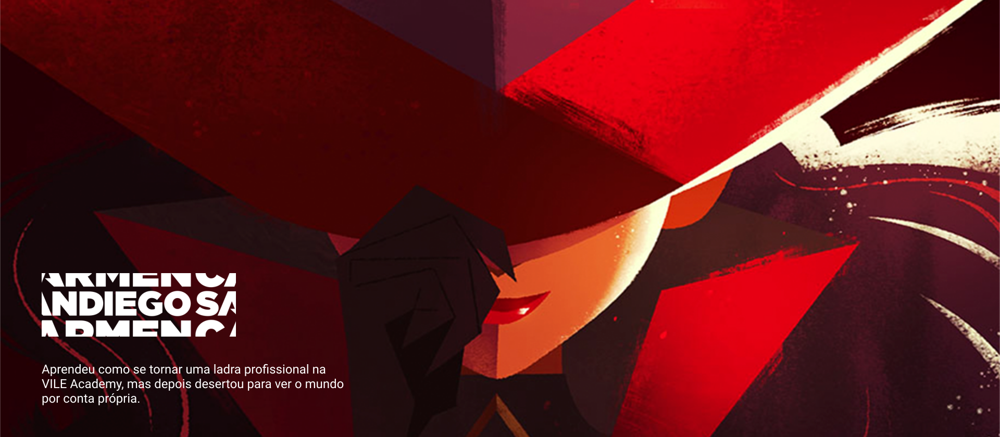

<h1 align="center"> Carmen Sandiego </h1>

"Aprendeu a se tornar uma ladra profissional na V.I.L.E. Academy, mas depois desertou para ver o mundo por conta própria" 

  <a href="#-tecnologias">Tecnologias</a>&nbsp;&nbsp;&nbsp;|&nbsp;&nbsp;&nbsp;
  <a href="#-projeto">Projeto</a>&nbsp;&nbsp;&nbsp;|&nbsp;&nbsp;&nbsp;
  <a href="#-layout">Layout</a>&nbsp;&nbsp;&nbsp;|&nbsp;&nbsp;&nbsp;
  <a href="#memo-licença">Licença</a>

  

 

  

## 🚀 Tecnologias

Esse projeto foi desenvolvido com as seguintes tecnologias:

- HTML, CSS, Bootstrap
- Git e Github
- Figma
- ChatGPT

## 💻 Projeto

Este projeto fala sobre a vida da famosa ladra internacional, Carmen Sandiego. Mostra os momentos históricos importantes da sua vida, seus aliados, seus inimigos e as suas habilidades.

Todos os textos do site foram construídos com a ajuda do ChatGPT e pesquisas feitas em sites fãs da franquia.

- [Visite o projeto online](https://carmen-sandiego.vercel.app/)

## 🔖 Layout

Você pode visualizar o layout do projeto através [DESSE LINK](https://www.figma.com/community/file/1319074728268626455/carmen-sandiego). É necessário ter a conta do [Figma](https://figma.com) para acessá-lo.

## :memo: Licença

Esse projeto está sob a licença MIT.
